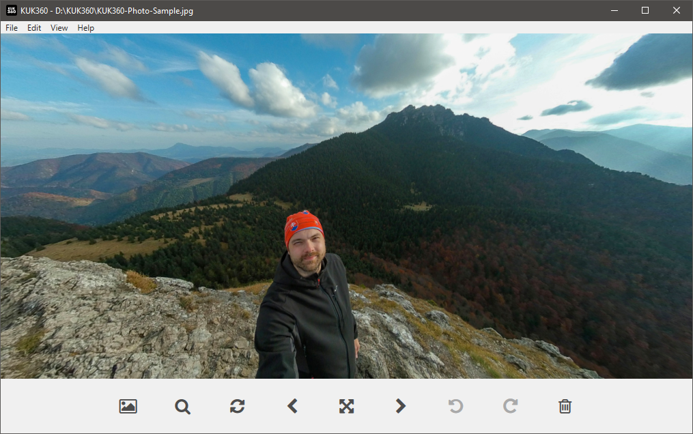

KUK360
======
**Simple 360 photo viewer for Windows**

## Table of Contents

* [Overview](#overview)
* [Features](#features)
* [Download](#download)
* [License](#license)
* [Support](#support)
* [About](#about)

## Overview

KUK360 can view any image in 360° projection and supports equirectangular/stitched photos taken by any 360° camera:

You can switch to a standard/flat projection anytime you need to examine the stitching lines or overall quality of your photos:

Easily accessible buttons help you navigate through your photos and provide quick access to frequently used features:

## Features

- Open source and completely free
- Fast and lightweight JPEG, TIFF, PNG, BMP and GIF image viewer
- Views images in 360° or flat/normal projection
- Seamlessly switches between images stored in the same folder
- Supports equirectangular/stitched photos from any 360° camera
- Runs in windowed or full screen mode
- Quickly deletes or copies image files

## Download

You can download the [latest release](https://github.com/jariq/KUK360/releases/latest) right away. What are you waiting for? :smile:

If you're just exploring the world of 360° photography and you don't have your own photos yet, then consider downloading my [sample equirectangular photo](img/KUK360-Photo-Sample.jpg).

## License

KUK360 is freely available under the terms of a very permissive MIT License.
Human friendly [license summary](https://www.tldrlegal.com/license/mit-license) is available at tldrlegal.com but the [full license text](LICENSE.md) always prevails.
Please note that KUK360 also uses various 3rd party components with their own respective licenses that are all present in the [full license text](LICENSE.md).

## Support

Please use the [issue tracker](https://github.com/jariq/KUK360/issues) to report any problems or suggest improvements.

## About

KUK360 has been written by [Jaroslav Imrich](https://www.jimrich.sk).